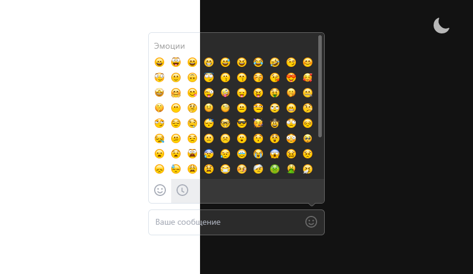

## TextField Emoji

Поле ввода с интерфейсом для добавления эмоджи и highlight. [Demo](https://textfield-emojis.herokuapp.com/)


### Тема

Более подробно про принципы построения светлой и темной темы интерфейса
[material design theme](https://material.io/design/color/dark-theme.html).



[theme.css](styles/theme.css)

### UI

- [TextField](src/ui/TextField/TextField.ts) - Текстовые поля с поддержкой `emoji` и `highlight`.

  <details>
    <summary>Методы</summary>

    ```ts
    new TextField(
      placeholder:    string           // текст для placeholder
      actionElement:  HTMLElement | '' // содержимое для активной области в левом углу (button)
      onChangeInput?: (string)         // return valueInput при изменении
    )
    create():HTMLElement               // return HTMLElement Scroll Overflow
    onFocus()                          // фокус на contenteditable элементе 
    ```
  </details>

- [List](src/ui/List/List.ts) - Список `emoji`.

  <details>
    <summary>Методы</summary>

    ```ts
    type emojisType = {
        title: string           // Заголовок для секции emoji
        items: string[]         // массив emoji в UTF8
    }

    new List (
      children: emojisType
      onClick: (emoji?: string) // return emoji по которому совершенно событие onClick
    )
    create():HTMLElement        // return HTMLElement list
    updateList(emojisType[])    // добавить контент
    newList(emojisType[])       // рендер нового листа
    ```
  </details>

- [Scroll](src/ui/Scroll/Scroll.ts) - Кроссбраузерный скроллбар.

  <details>
    <summary>Методы</summary>

    ```ts
    new Scroll(
      children:  HTMLElement // оборачивает children в контейнер со скроллом
      onUpdate?: (number)    // return number - процент пройденного расстояния от начала
    )
    create():HTMLElement     // return HTMLElement Scroll Overflow
    ```
  </details>

- [Tabs](src/ui/Tabs/Tabs.ts) - Вкладки позволяют переключаться между различными представлениями.

  <details>
    <summary>Методы</summary>

    ```ts
    new Tabs(
      children: {
        tabContent: HTMLElement  // контент для tab
        button:     string       // содержимое для кнопки
      }
      changeTabIndex?: ():number // return number - onChange indexTabActive
    )
    create():HTMLElement         // return создает из children tabs

    setIndexActiveTab(number)    // принимает новый индекс для активного tab
    ```
  </details>

- [TouchDriver](src/ui/TouchDriver/TouchDriver.ts) - Вычисляет взаимодействие с компонентов по координатам `X` и `Y`.

  <details>
    <summary>Методы</summary>

    ```ts
    type MoveCoord = {
        startX: number
        startY: number
        nowX:   number
        nowY:   number
        shiftX: number
        shiftY: number
        deltaX: number
        deltaY: number
    }
    // принимает 3 callback функции
    new TouchDriver(
      moveStart(MoveCoord) // return MoveCoord при касании к области внутри компонента
      move(MoveCoord)      // return MoveCoord при движении курсора или пальца по области компонента
      moveEnd(MoveCoord)   // return MoveCoord при завершении взаимодействия с компонентом
    )
    ```

  </details>

- [Button](src/ui/Button/Button.ts) - кнопка

  <details>
    <summary>Методы</summary>

    ```ts
  Button({
      type: string,        // тип кнопки 'div' | 'button' | ...
      className: string[], // массив css классов
      children?: string,   // содержимое кнопки
      onClick: () => void  // функция callback на события click
  })
    ```

  </details>

- [Icons](src/ui/Icons/Icons.ts) - Иконки `{ Smile, Clock }`. 

### Store и render

Структура `Store`

```ts
class Store {
    init() {
        // инициализируем store
    }
    getState() {
        // отдаем store
    }
    subscribe() {
        // подписываем слушателей на изменения в store
    }
    setState() {
        // обновляем store и оповещаем об этом все подписавшихся
    }
}
```

Структура `observerRender`

```ts
// observerRender подписывается на изменения а Store
function observerRender(oldState, newState) {

    // 0 - save State в LocalStorage

    // 1 - отслеживаем изменения нужного состояния
    if (oldState.value !== newState.value) {
        // 2 -реагируем на изменения нужного состояния
    }
}
```

### Highlight `url` | `mail` | `#` | `@`

Замена в real-time нужных вхождений реализована через DOM diffing подход.
При выявлении изменений в подсветке, создается [VirtualDom](src/ui/utils/virtualDom.ts) у node с атрибутом `contenteditable="true"` и заменяет потомков которые изменились.

### Keyboard

`Tab` - открыть/закрыть окно с emoji.

`ctrl` + `ё` - сменить тему.

`Left` `Right` `Up` `Down` - перемещение в окне emoji.

`Enter` - выбор emoji в окне.